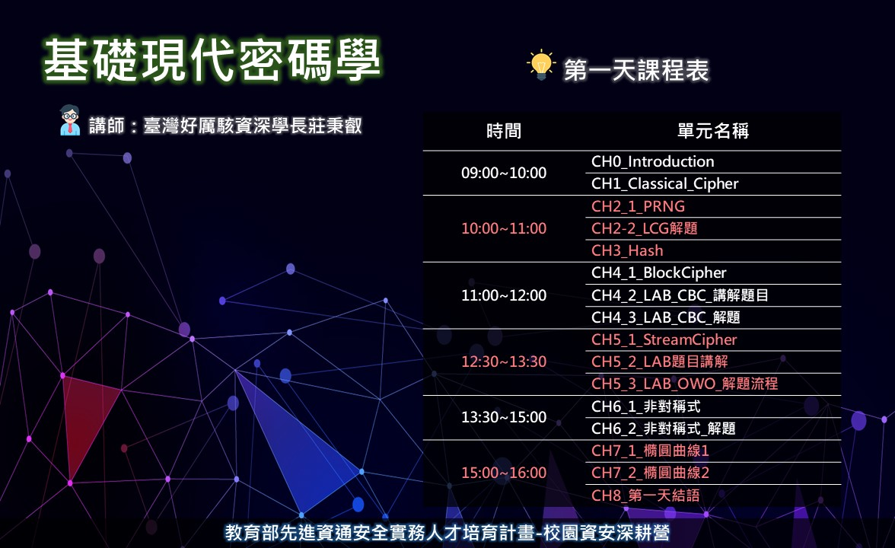
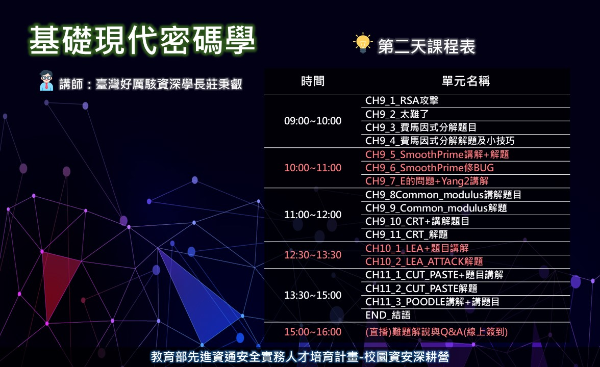

# 2021年7月10日-11日基礎現代密碼學課程

```
教育部先進資通安全實務人才培育計畫
校園資安深耕營Advanced Happy CyberSecurity Day

課程名稱：基礎現代密碼學

課程大綱：本課程介紹密碼學基本觀念與常用工具，包含古典密碼學、
亂數與雜湊函式及現代密碼的對稱式加密、
非對稱式加密(RSA, ECC)，
並針對RSA演算法攻擊進行說明，
另外也講解已知的雜湊函式攻擊(長度擴充攻擊LEA Attack)與對稱式加密攻擊。

講師：臺灣好厲駭資深學長莊秉叡

先備知識：需了解 Python 程式的基本語法

事先需安裝之軟體：
[1]Sagemath下載網址 https://www.sagemath.org/download.html
            
[2]pwntools下載網址 https://github.com/Gallopsled/pwntools

學員證書發放說明：
(1)學員需完成指定題目達14題以上。
(2)證書只提供給具本國籍國中高中職五專在學學生(含應屆畢業生)。
(3)本主辦單位保有最終修改、變更、活動解釋及取消之權利。

✪指導單位：教育部資訊及科技教育司
✪主辦單位：教育部先進資通安全實務人才培育計畫推動辦公室、崑山科技大學、國立宜蘭大學、國立臺中高工
✪聯絡窗口：陳小姐0928-155-602 / E-mail:samtn125@gmail.com或洽FB粉絲頁(高中職生資安研習營)
```
# 2021年7月10日課程表


# 2021年7月11日課程表


# 課程問題提問表單
```
學員對課程上或解題上有任何問題的可以在表單上提問直播時講師會解答
https://forms.gle/Ju9uq5Bh21BUcbrG6
```
# CTF平台
```
一人一隊，請自行註冊(並請記得註冊EMAIL與帳號將提供驗證核發證書使用)
http://140.110.112.215/
```

# 課程簡報[課後將刪除連結]

https://github.com/MyFirstSecurity2020/MyfirstCryptoX/blob/main/20210710基礎現代密碼學簡報.pdf

# 2021年7月10日課程YouTube連結[課後將刪除]

|章節|影片|片長|影片連結|
|---|:-----|:----:|:--------------------------|
|0|CH0_Introduction|30:38|https://youtu.be/vzMq63t_rfw |
|1|CH1_Classical_Cipher|17:43|https://youtu.be/l2fuWlpfHmU |
|2|CH2_PRNG|15:06|https://youtu.be/soppCtH9liU |		
|2|CH2-2_LCG解題|18:29|https://youtu.be/pkodsDphLWo |
|3|CH3_Hash|15:23| https://youtu.be/-fH4vJtKNIg  |
|4|CH4_BlockCipher|28:19| https://youtu.be/5ZMc5aL7RqU |
|4|CH4-2_LAB_CBC_講解題目|5:41|https://youtu.be/4-hQ_00sEt0 |			
|4|CH4-3_LAB_CBC_解題|12:46|https://youtu.be/At2DvKHTtP8 |
|5|CH5_StreamCipher|18:17|     https://youtu.be/4jx0od6S2C0	 |	
|5|CH5-2_LAB題目講解|3:53|	https://youtu.be/99DECbRH6KQ |		
|5|CH5-3_LAB_OWO_解題流程|11:33|https://youtu.be/lmcVBIgrEwk |
|6|CH6_非對稱式 | 56:53|	https://youtu.be/pxP56vHbErA	|	
|6|CH6-2_非對稱式_解題| 13:28 |    https://youtu.be/kXcRmdlf2SM |
|7|CH7_橢圓曲線| 38:01| https://youtu.be/KdYoytkCMCM |		
|7|CH7-2_橢圓曲線| 7:17|https://youtu.be/mWbgkiHluKk |
|8| CH8-第一天結語|  2:25 | https://youtu.be/ktSqHtFChfQ |

# 2021年7月11日課程YouTube連結[課後將刪除]

|章節|影片|片長|影片連結|
|---|:--------|:----:|:--------------------------|
|9|CH9_RSA攻擊|13:04|https://youtu.be/ETKYHTCMVtQ |
|9|CH9-2_太難了|17:53|https://youtu.be/WTGWagdXHgY  |
|9|CH9-3_費馬因式分解題目|4:32|	https://youtu.be/i07ZRE7up94 |		
|9|CH9-4_費馬因式分解解題與小技巧|7:40|https://youtu.be/z8vcttNlocw  |
|9|CH9-5_SmoothPrime講解+解題|17:04|https://youtu.be/J7RS6juWDaM  |
|9|CH9-6_SmoothPrime修BUG|2:55|https://youtu.be/0LxFPzR8DFc	| 	
|9|CH9-7_E的問題+Yang2講解|15:01|https://youtu.be/2lNB3-HUliI	|
|9|CH9-8Common_modulus 講解題目|5:49|https://youtu.be/njDkkwSdqMY	|	
|9|CH9-9_Common_modulus 解題|6:49|https://youtu.be/ONnMvFshG24  |		
|9|CH9-10_CRT+講解題目|9:51|https://youtu.be/8rRskGwVdw8	|		
|9|CH9-11_CRT_解題|2:37|https://youtu.be/vyna_Ni0HEE |
|10|CH10-1_LEA+題目講解|17:20|https://youtu.be/UtKAhsbLGeM | 
|10|CH10-2_LEA_ATTACK解題|9:39|https://youtu.be/qcvf5aEvMsA | 
|11|CH11_CUT_PASTE+題目講解|5:18|https://youtu.be/_pVMbWlh7zc | 
|11|CH11-2_CUT_PASTE解題|7:18|https://youtu.be/9gTbRAEf0Ek | 
|11|CH11-3_POODLE講解+講題目|18:12|https://youtu.be/rYqeAlJciqI | 
|END|結語|0:39|https://youtu.be/o-tq713y4UY |

# 7月11日15:00線上簽到與難題解說與Q&A直播

```
(1)請學員到”通話中的訊息”留下**學校-姓名**簽到，謝謝
(2)14:50開放進入會議室
(3)會議連結：https://meet.google.com/twg-ygdu-aor

```

# 證書核發
```

```
