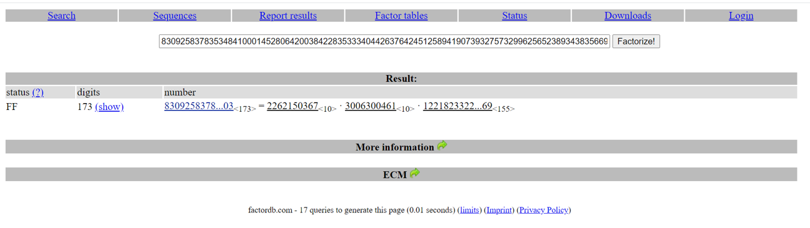

# 攻擊 RSA
```
RSA安全是建立在質因數難解的基礎 <== 這是有數學證明的

但是實作上選擇錯誤的質數會造成容易破解

本文簡述幾項範例
更多的說明請參考講師上課內容
```

```
本文感謝臺灣好厲駭第1-4屆優秀學員 楊明軒 提供部分簡報內容與實測
```

# n 不夠大 ==> 可分解出 p,q  ==> YANG_RSA-1

## YANG_RSA-1 題目敘述
```
RSA加密演算法是一種非對稱加密演算法，
在公開金鑰加密和電子商業中RSA加密被廣泛使用。

RSA的安全性是建立在大數分解的困難上，如果n不夠大就無法保證其安全性，
對一極大整數做因數分解愈困難，RSA演算法愈可靠。

你了解RSA的基本加解密了嗎?
請解密附件檔案

提示1 : n很小可以使用 http://factordb.com/ 先分解出p和q質數
提示2 : 分解出p和q質數後算出d，用d去解c
```

```
n = 83092583783534841000145280642003842283533340442637642451258941907393275732996256523893438356692786223410880194199043046345864683398238392329295750150314289824255749149834103

e = 11

c = 32392151763267291269610586564983347951891395196084251182633225594245167922176424232164117237142038355860036871811244158149537196288428230971760474130300660929743492107190512
```
## 使用線上網站 http://factordb.com   分解質因數



```
#!/usr/bin/env python
from Crypto.Util.number import *
import gmpy

p = 2262150367
q = 3006300461
r = 12218233223644524650141958853163065112163255395621655741865064529020634406575730714768264558014607893896434523845321502371618344594488810317052606914954669

n = 83092583783534841000145280642003842283533340442637642451258941907393275732996256523893438356692786223410880194199043046345864683398238392329295750150314289824255749149834103

e = 11

c = 32392151763267291269610586564983347951891395196084251182633225594245167922176424232164117237142038355860036871811244158149537196288428230971760474130300660929743492107190512

phi = (p-1)*(q-1)*(r-1)
d = int(gmpy.invert(e, phi))
m = pow(c,d,n)
print(long_to_bytes(m))
```
```
Crypto.Util.number.long_to_bytes 的說明
Crypto.Util.number.long_to_bytes(n, blocksize=0)
Convert an integer to a byte string.

https://pycryptodome.readthedocs.io/en/latest/src/util/util.html#module-Crypto.Util.number
```
